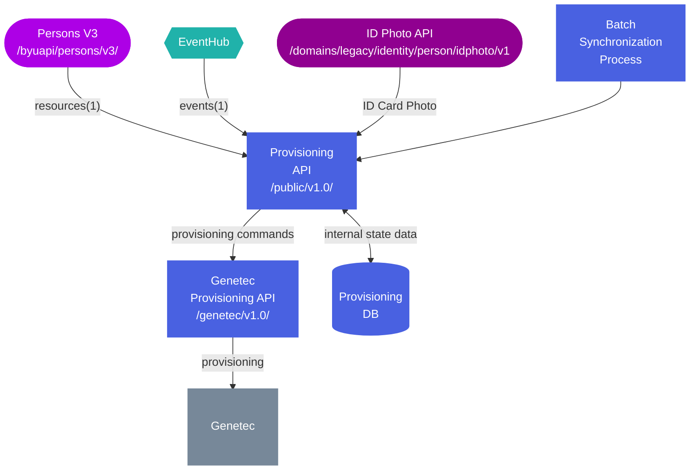
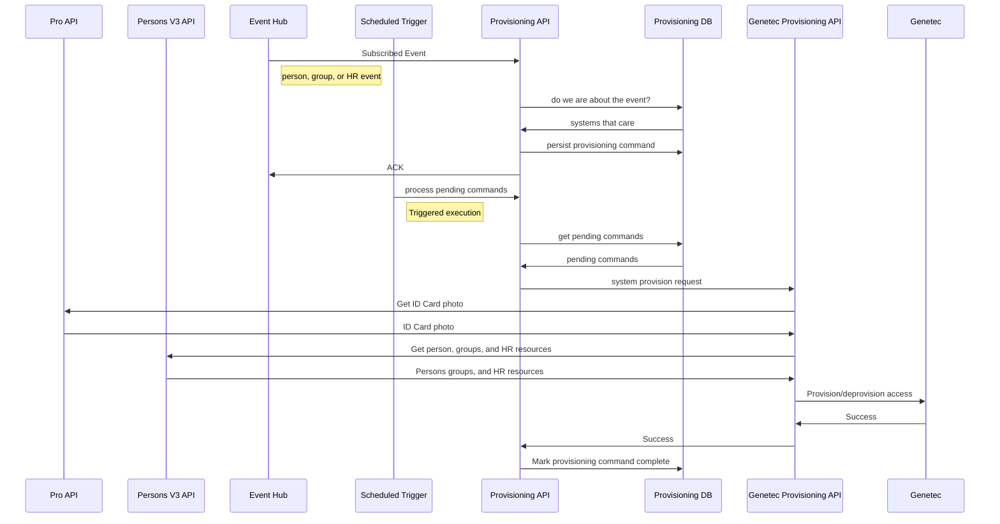

## This is a test diagram 

```mermaid
flowchart TD
%% test of genetec flow
classDef default fill:#4961E1,stroke:#4961E1,color:#ffffff,stroke-width:4px;
classDef BYUAPI fill:#AD00E6,stroke:#AD00E6,stroke-width:4px;
classDef DomainAPI fill:#900090,stroke:#900090,stroke-width:4px;
classDef BYUInfrastructure fill:#20b2aa,stroke:#20b2aa,stroke-width:4px;
classDef Target fill:#778899,stroke:#778899,color:#ffffff,stroke-width:4px;

    idPhotoAPI(["ID Photo API\n/domains/legacy/identity/person/idphoto/v1"]) 
        click idPhotoAPI "https://byu.sharepoint.com/:x:/s/CESArchitectureCouncil/Eb-rSuCCW2JNuJE34j0KVIABlk2dFPmHxhFjOk0Y46doWA?e=Fpr9JX&activeCell='IDPhoto'!A1" "API Definition" _blank
    personsV3(["Persons V3\n /byuapi/persons/v3/"])
        click personsV3 "https://byu.sharepoint.com/:x:/s/CESArchitectureCouncil/Eb-rSuCCW2JNuJE34j0KVIABlk2dFPmHxhFjOk0Y46doWA?e=Fpr9JX&activeCell='PersonsV3'!A1" "API Definition" _blank
    EventHub{{EventHub}}
        click EventHub "https://byu.sharepoint.com/:x:/s/CESArchitectureCouncil/Eb-rSuCCW2JNuJE34j0KVIABlk2dFPmHxhFjOk0Y46doWA?e=Fpr9JX&activeCell='Events'!A1" "API Definition" _blank
    
    ProvisioningAPI["Provisioning\n API\n/public/v1.0/"]
    GenetecProvisioningAPI["Genetec\n Provisioning API\n /genetec/v1.0/"]
    ProvisioningDB[(Provisioning\n DB )]
    Genetec[ \nGenetec\n\n]
    BatchSync[Batch\n Synchronization\n Process]

    personsV3 -- "resources(1) " --> ProvisioningAPI
    EventHub -- "events(1)"  --> ProvisioningAPI
    idPhotoAPI -- ID Card Photo --> ProvisioningAPI
    ProvisioningAPI -- provisioning commands --> GenetecProvisioningAPI
    GenetecProvisioningAPI -- provisioning --> Genetec
    ProvisioningAPI <-- internal state data --> ProvisioningDB
    BatchSync --> ProvisioningAPI

class personsV3 BYUAPI;
class EventHub,ExternalTrigger BYUInfrastructure;
class Genetec Target;
class idPhotoAPI DomainAPI
```
## Sequence diagram

```mermaid
sequenceDiagram

    participant proAPI as Pro API
    participant personsV3 as Persons V3 API
    participant eventHub as Event Hub
    participant scheduledTrigger as Scheduled Trigger
    participant provisioningAPI as Provisioning API
    participant provisioningDB as Provisioning DB
    participant genetecAPI as Genetec Provisioning API
    participant genetec as Genetec
 

    eventHub ->> provisioningAPI:Subscribed Event
    note right of eventHub: person, group, or HR event
    provisioningAPI ->> provisioningDB: do we are about the event?
    provisioningDB ->> provisioningAPI: systems that care
    provisioningAPI ->> provisioningDB: persist provisioning command
    provisioningAPI ->> eventHub: ACK

    scheduledTrigger ->> provisioningAPI: process pending commands
    note right of scheduledTrigger: Triggered execution
    provisioningAPI ->> provisioningDB: get pending commands
    provisioningDB ->> provisioningAPI: pending commands
    provisioningAPI ->> genetecAPI: system provision request
    genetecAPI ->> proAPI: Get ID Card photo
    proAPI ->> genetecAPI: ID Card photo
    genetecAPI ->> personsV3: Get person, groups, and HR resources
    personsV3 ->> genetecAPI: Persons groups, and HR resources
    genetecAPI ->> genetec: Provision/deprovision access
    genetec ->> genetecAPI: Success
    genetecAPI ->> provisioningAPI: Success
    provisioningAPI ->> provisioningDB: Mark provisioning command complete

```
So this is more descriptive text to go with it as well.

